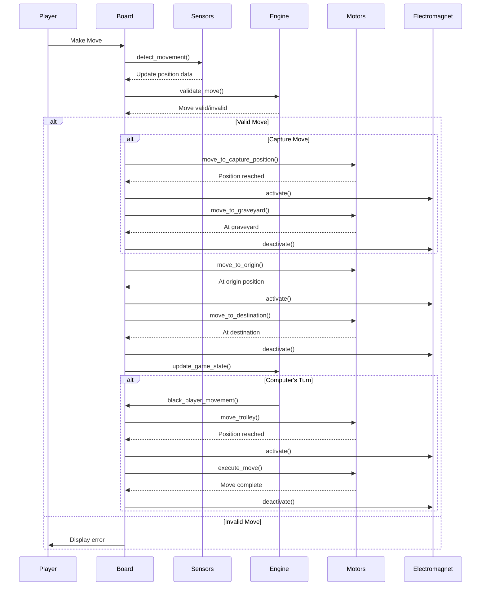
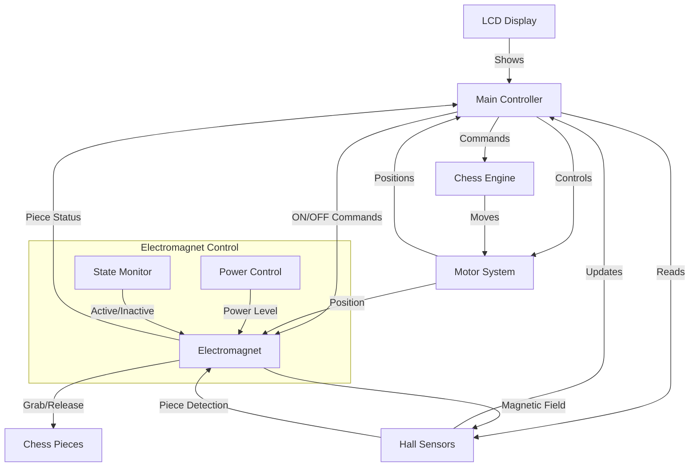

# Automated Chessboard Technical Specifications

## Table of Contents
1. [System Overview](#system-overview)
2. [Function Documentation](#function-documentation)
3. [Interaction Diagrams](#interaction-diagrams)
4. [Dependencies](#dependencies)

## System Overview
The Automated Chessboard system consists of several interconnected components that work together to enable autonomous chess gameplay. The system includes hardware control for piece movement, sensor management for piece detection, and chess engine integration for game logic.

## Function Documentation

### Movement Control Functions

#### `void detect_movement()`
**Purpose:** Detects changes in the Hall effect sensors to identify piece movements on the board.
**Parameters:** None
**Returns:** void
**Global Variables Modified:**
- `captured`: Boolean indicating if a piece was captured
- `origin_x`, `origin_y`: Starting coordinates of the move
- `destination_x`, `destination_y`: Ending coordinates of the move
**Usage Example:**
```cpp
detect_movement();  // Call this to update movement coordinates
if (captured) {
    // Handle capture logic
}
```

#### `void move_trolley(int x, int y)`
**Purpose:** Controls the physical movement of the trolley mechanism to a specific position.
**Parameters:**
- `x`: X-coordinate on the board (0-7)
- `y`: Y-coordinate on the board (0-7)
**Returns:** void
**Usage Example:**
```cpp
move_trolley(3, 4);  // Move trolley to position d5
```

#### `void black_player_movement()`
**Purpose:** Orchestrates the movement sequence for the computer's (black) pieces.
**Parameters:** None
**Returns:** void
**Sequence:**
1. Detects intended move
2. Handles piece capture if necessary
3. Moves black piece to destination
**Usage Example:**
```cpp
black_player_movement();  // Execute computer's move
```

### Sensor Management Functions

#### `bool piece_detected(int x, int y)`
**Purpose:** Checks if a chess piece is present at specific coordinates.
**Parameters:**
- `x`: X-coordinate to check (0-7)
- `y`: Y-coordinate to check (0-7)
**Returns:** true if piece present, false if empty
**Usage Example:**
```cpp
if (piece_detected(0, 0)) {
    // Handle piece presence
}
```

[Additional functions will be documented as we analyze the codebase]

## Interaction Diagrams

### Game Flow Sequence


### Component Interaction


## Dependencies

### Hardware Dependencies
- Arduino Mega 2560
- Hall Effect Sensors (64 units)
- Stepper Motors (2 units)
- LCD Display (I2C interface)
- Electromagnet System

### Software Dependencies
- Arduino IDE
- Libraries:
  - `Wire.h`: I2C communication
  - `LiquidCrystal_I2C.h`: LCD control
  - `Stepper.h`: Motor control

### Custom Libraries
- `Micro_Max.h`: Chess engine implementation
- `global.h`: Global variables and configurations
